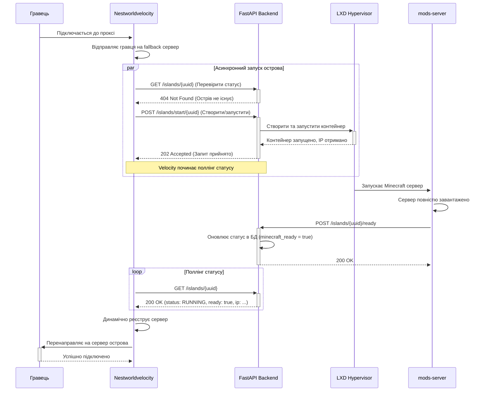
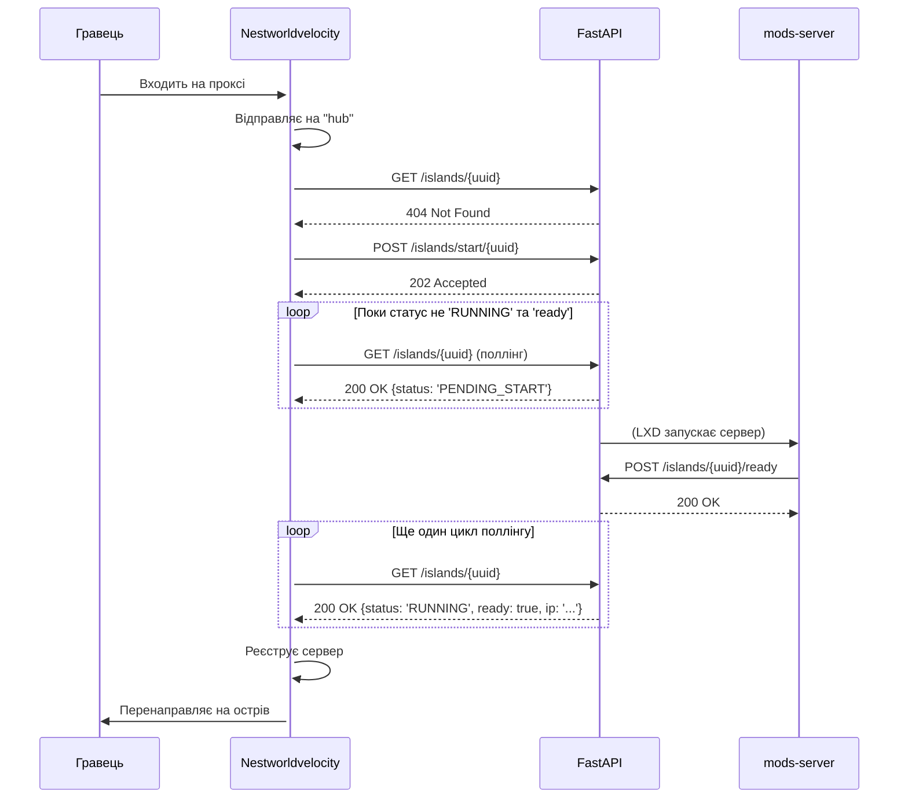
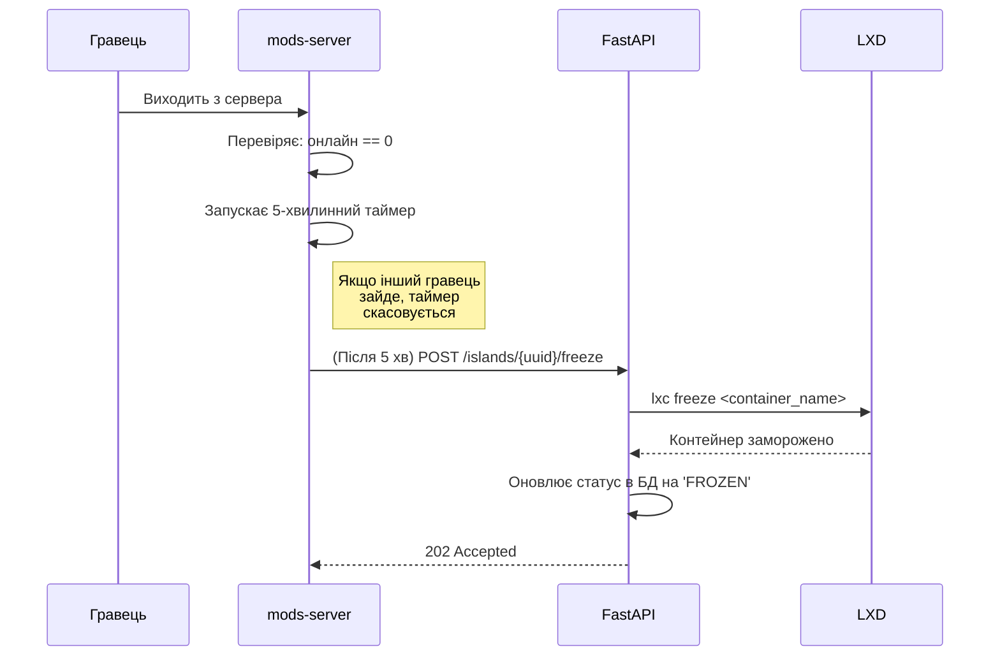

# Глибокий аналіз архітектури Dynamic SkyBlock Island System

Цей документ містить детальний аналіз архітектури, логіки та компонентів системи Dynamic SkyBlock Island.

## A. Архітектурний аналіз

### A.1. Взаємодія компонентів
Система складається з трьох ключових, незалежно розгорнутих компонентів, які взаємодіють між собою через REST API.

1.  **`FastAPI Backend (api/)`**:
    *   **Роль**: Центральний "мозок" системи.
    *   **Функції**: Управляє життєвим циклом LXD контейнерів (створення, запуск, зупинка, заморозка), веде облік стану всіх островів у базі даних (MySQL/MariaDB), надає REST API для інших компонентів.
    *   **Взаємодія**: Приймає HTTP-запити від `Nestworldvelocity` для запуску/перевірки стану островів та від `mods-server` для оновлення статусу готовності або ініціації заморозки.

2.  **`Velocity Proxy Plugin (Nestworldvelocity/)`**:
    *   **Роль**: Точка входу для гравців.
    *   **Функції**: Маршрутизує гравців. При підключенні гравця, плагін відправляє його на тимчасовий "fallback" сервер. Паралельно, він асинхронно комунікує з `api`, щоб перевірити статус персонального острова гравця. Якщо острів не запущений, плагін ініціює його старт через API. Після успішного запуску та готовності сервера, плагін динамічно реєструє острів у Velocity та перенаправляє на нього гравця.
    *   **Взаємодія**: Виступає як клієнт для `api`, використовуючи HTTP-запити для отримання статусу та запуску островів.

3.  **`Forge Server Mod (mods-server/)`**:
    *   **Роль**: Агент, що працює всередині кожного LXD контейнера (на кожному острові).
    *   **Функції**: Моніторить стан сервера Minecraft. Після повного завантаження світу, мод надсилає сигнал готовності до `api`. Коли останній гравець виходить з сервера, мод запускає таймер, після закінчення якого надсилає запит до `api` на "заморозку" контейнера для економії ресурсів.
    *   **Взаємодія**: Також виступає як клієнт для `api`, інформуючи його про ключові події життєвого циклу Minecraft сервера.

### A.2. Діаграма потоку даних
Ця діаграма ілюструє типовий сценарій підключення гравця до свого острова.

### A.3. Ключові API Endpoints
Взаємодія між компонентами відбувається через наступні REST API ендпоінти, реалізовані в `api/app/api/v1/endpoints/islands.py`:

*   **`GET /islands/{player_uuid}`**:
    *   **Призначення**: Отримати поточний статус, IP-адресу та порт острова для вказаного гравця.
    *   **Хто використовує**: `Nestworldvelocity` (для поллінга стану острова).

*   **`POST /islands/start/{player_uuid}`**:
    *   **Призначення**: Запустити існуючий (зупинений/заморожений) острів або створити новий, якщо він не існує. Це асинхронна операція, яка повертає `202 Accepted` і виконується у фоні.
    *   **Хто використовує**: `Nestworldvelocity` (коли гравець підключається і його острів неактивний).

*   **`POST /islands/stop/{player_uuid}`**:
    *   **Призначення**: Повністю зупинити контейнер острова.
    *   **Хто використовує**: `Nestworldvelocity` (якщо гравець відключився під час запуску острова), або адміністративні скрипти.

*   **`POST /islands/{player_uuid}/freeze`**:
    *   **Призначення**: "Заморозити" контейнер (cgroup freezer). Це зберігає стан сервера в RAM, але майже не використовує CPU. Дозволяє дуже швидко відновити роботу.
    *   **Хто використовує**: `mods-server` (коли останній гравець виходить з сервера).

*   **`POST /islands/{owner_uuid}/ready`**:
    *   **Призначення**: Сигналізувати, що сервер Minecraft всередині контейнера повністю завантажився і готовий приймати гравців.
    *   **Хто використовує**: `mods-server` (після старту сервера).

### A.4. Структура бази даних
Стан системи зберігається в реляційній базі даних (MySQL/MariaDB). Схема визначена у файлі `api/sql/schema.sql`.

**Ключова таблиця: `islands`**

| Поле | Тип | Призначення |
| --- | --- | --- |
| `id` | INT | Унікальний ідентифікатор запису |
| `player_uuid` | VARCHAR(36) | UUID гравця-власника острова (унікальне) |
| `container_name`| VARCHAR(255) | Ім'я LXD контейнера (унікальне) |
| `status` | VARCHAR(50) | Поточний стан острова (`CREATING`, `STOPPED`, `RUNNING`, `FROZEN`, `ERROR`) |
| `internal_ip_address` | VARCHAR(45) | Внутрішня IP-адреса контейнера |
| `internal_port` | INT | Порт сервера Minecraft всередині контейнера (за замовчуванням 25565) |
| `last_seen_at` | TIMESTAMP | Час останньої активності гравця |

**Допоміжні таблиці:**

*   **`island_queue`**: Таблиця для управління чергою гравців, які очікують на запуск свого острова (хоча поточна логіка в `PlayerConnectionListener` обробляє це без черги в БД).
*   **`island_settings`**: Для зберігання додаткових налаштувань острова.
*   **`island_backups`**: Для обліку снепшотів та бекапів LXD.

## B. Життєвий цикл острова
Життєвий цикл острова керується через API і ініціюється діями гравця або сервера.

### B.1. Створення нового острова
Процес створення ініціюється, коли гравець вперше підключається до Velocity, і для нього ще не існує острова.

1.  **Ініціація**: `Nestworldvelocity` (`PlayerConnectionListener`) надсилає запит `GET /islands/{player_uuid}` до API.
2.  **Перевірка**: API не знаходить запису в таблиці `islands` для цього `player_uuid` і повертає `404 Not Found`.
3.  **Запит на створення**: Отримавши 404, `Nestworldvelocity` негайно надсилає `POST /islands/start/{player_uuid}`.
4.  **Створення в API**:
    *   `island_service` отримує цей запит.
    *   Створюється новий запис у таблиці `islands` зі статусом `CREATING`.
    *   API віддає команду LXD створити новий контейнер шляхом клонування з базового образу (наприклад, `your-base-image-alias` з конфігурації).
    *   API повертає `202 Accepted`, і `Nestworldvelocity` починає поллінг.
5.  **Запуск сервера**: Після створення контейнера, LXD автоматично запускає його. Всередині контейнера стартує Minecraft сервер з модом `mods-server`.
6.  **Сигнал готовності**: Коли сервер Minecraft повністю завантажується, `mods-server` (`SkyBlockMod`) надсилає запит `POST /islands/{owner_uuid}/ready`.
7.  **Оновлення статусу**: API отримує цей сигнал, оновлює статус острова в базі даних на `RUNNING` і встановлює прапорець `minecraft_ready = true`.
8.  **Підключення гравця**: Під час чергового поллінгу, `Nestworldvelocity` бачить новий статус і підключає гравця.

### B.2. Запуск існуючого острова
Цей процес відбувається, коли гравець повторно підключається, а його острів знаходиться у стані `STOPPED` або `FROZEN`.

1.  **Ініціація**: `Nestworldvelocity` надсилає `GET /islands/{player_uuid}`.
2.  **Перевірка**: API знаходить острів і повертає `200 OK` зі статусом `STOPPED` або `FROZEN`.
3.  **Запит на запуск**: `Nestworldvelocity` (`pollForRunningAndConnect`) бачить цей статус і надсилає `POST /islands/start/{player_uuid}`.
4.  **Запуск в API**:
    *   `island_service` змінює статус в БД на `PENDING_START`.
    *   API віддає команду LXD запустити (`lxc start`) або розморозити (`lxc unfreeze`) існуючий контейнер.
    *   API повертає `202 Accepted`.
5.  **Подальші кроки**: Процес продовжується так само, як і при створенні, починаючи з кроку 5 (запуск сервера, сигнал готовності, підключення гравця).

### B.3. Зупинка/Заморожування острова
Система використовує два підходи для економії ресурсів: "заморозку" (швидке відновлення) і повну зупинку.

**Заморожування (Freeze):**
Це стандартний механізм, коли гравець просто виходить з гри.

1.  **Ініціація**: Останній гравець виходить з сервера-острова.
2.  **Таймер в моді**: `mods-server` (`PlayerEventHandler`) виявляє, що онлайн 0 гравців. Якщо були виконані умови (гравець заходив у першу годину), запускається 5-хвилинний таймер.
3.  **Скасування**: Якщо протягом цих 5 хвилин на сервер заходить інший гравець, таймер скасовується.
4.  **Запит на заморозку**: Якщо таймер завершується, `mods-server` надсилає `POST /islands/{player_uuid}/freeze`.
5.  **Обробка в API**: `island_service` отримує запит, змінює статус в БД на `FROZEN` і виконує команду `lxc freeze` для відповідного контейнера.

**Зупинка (Stop):**
Це більш рідкісний сценарій, який використовується для повного вивільнення ресурсів RAM.

1.  **Ініціація**: Гравець підключається до Velocity, починається процес запуску його острова, але гравець відключається від проксі, *не дочекавшись* підключення до острова.
2.  **Обробка в плагіні**: `Nestworldvelocity` (`PlayerConnectionListener`) виявляє це у події `onPlayerDisconnect`.
3.  **Запит на зупинку**: Плагін негайно надсилає `POST /islands/stop/{player_uuid}`, щоб скасувати запуск і зберегти ресурси.
4.  **Обробка в API**: `island_service` отримує запит, змінює статус на `STOPPED` і виконує команду `lxc stop`.

### B.4. Видалення острова
У поточному коді немає прямої реалізації ендпоінта для видалення острова гравцем або автоматично. Ймовірно, ця операція передбачена для адміністраторів і виконується вручну через API або безпосередньо в базі даних та LXD.

## C. Обробка подій
Система реагує на дві ключові події: підключення та відключення гравця.

### C.1. Під'єднання гравця
Цей процес обробляється в `Nestworldvelocity` в класі `PlayerConnectionListener.java`.

**Коли гравець заходить вперше (або його острів зупинено):**

1.  **Подія `PlayerChooseInitialServerEvent`**: Плагін перехоплює цю подію.
2.  **Переміщення на Fallback**: Гравця примусово відправляють на сервер, вказаний у `fallback_server` в конфігурації (наприклад, "hub"). Це робиться для того, щоб гравець не чекав у порожнечі, поки його острів завантажується.
3.  **Асинхронний запуск `pollForRunningAndConnect`**: Негайно після відправки на fallback, запускається асинхронна задача, яка починає "опитувати" API щодо стану острова.
4.  **"Машина станів" у поллері**:
    *   **Острів не існує (404)**: Надсилається запит на створення.
    *   **Острів зупинений/заморожений**: Надсилається запит на запуск.
    *   **Острів запускається (`PENDING_*`)**: Гравець отримує повідомлення "Будь ласка, зачекайте..." і поллінг продовжується через `polling_interval_millis`.
    *   **Острів запущений (`RUNNING`), але Minecraft ще не готовий (`minecraft_ready: false`)**: Гравець отримує повідомлення, що Minecraft ще завантажується, поллінг продовжується.
    *   **Острів повністю готовий (`RUNNING` і `minecraft_ready: true`)**:
        *   Плагін отримує IP-адресу та порт контейнера.
        *   Динамічно реєструє новий сервер у Velocity з унікальним іменем (наприклад, `island-playerUUID`).
        *   Надсилає гравцю запит на підключення до цього нового сервера.

**Коли гравець заходить, а його острів вже працює:**

*   Процес відбувається значно швидше. Вже під час першого або другого запиту поллінгу API повертає статус `RUNNING` та `minecraft_ready: true`, що призводить до негайного підключення.

### C.2. Від'єднання гравця
Ця логіка розділена між `Nestworldvelocity` (глобальний рівень) та `mods-server` (локальний рівень острова).

**Логіка в `mods-server` (`PlayerEventHandler.java`):**

1.  **Подія `PlayerLoggedOutEvent`**: Мод перехоплює подію виходу гравця *з сервера-острова*.
2.  **Перевірка кількості гравців**: Мод перевіряє, чи залишилися на сервері ще гравці (`server.getPlayerCount() - 1 == 0`).
3.  **Запуск таймера заморозки**: Якщо це був останній гравець, і виконана умова `playerJoinedWithinFirstHour`, запускається 5-хвилинний таймер.
4.  **Виклик API**: Після закінчення таймера, мод надсилає запит `POST /islands/{uuid}/freeze` до API.
5.  **Скасування таймера**: Якщо під час цих 5 хвилин інший гравець заходить на сервер (`onPlayerLogin`), таймер скасовується.

**Логіка в `Nestworldvelocity` (`PlayerConnectionListener.java`):**

1.  **Подія `DisconnectEvent`**: Плагін перехоплює подію відключення гравця *від проксі-сервера*.
2.  **Сценарій 1: Гравець відключився під час запуску острова**:
    *   Плагін перевіряє, чи знаходиться UUID гравця у списку `pendingStartPlayers`.
    *   Якщо так, це означає, що гравець не дочекався запуску.
    *   Плагін надсилає `POST /islands/stop/{uuid}` до API, щоб негайно зупинити контейнер і звільнити ресурси.
3.  **Сценарій 2: Гравець відключився з уже працюючого острова**:
    *   Плагін отримує з API список всіх членів команди цього гравця.
    *   Перевіряє, чи є хтось із членів команди онлайн *на цьому ж сервері-острові*.
    *   Якщо так, нічого не відбувається.
    *   Якщо це був останній член команди, плагін запускає свій власний **5-хвилинний таймер** на зупинку острова (через `requestIslandStop`).
    *   **Важливо**: Ця логіка в `Nestworldvelocity` дублює логіку заморозки в `mods-server`. Однак, логіка в моді (`freeze`) є більш ефективною, оскільки "заморозка" швидша за повну зупинку. Логіка в Velocity є скоріше запасною.

### C.3. Діаграми послідовності

**Сценарій: Перше підключення гравця**

**Сценарій: Відключення останнього гравця**

## D. LXD інтеграція
Взаємодія з LXD є ключовою функцією `FastAPI Backend` і реалізована в `app/services/island_service.py`, який, ймовірно, використовує Python бібліотеку для роботи з LXD (наприклад, `pylxd`).

*   **Створення контейнерів**: Нові острови створюються шляхом клонування попередньо налаштованого базового LXD образу. Назва цього образу (`LXD_BASE_IMAGE`) вказується у файлі `.env`. Це ефективний підхід, оскільки всі необхідні залежності (Java, Forge, мод) встановлюються лише один раз.
*   **Конфігурація**: При створенні до контейнера застосовуються LXD профілі (наприклад, `default`, `skyblock`), які також вказуються в `.env` (`LXD_DEFAULT_PROFILES`). Ці профілі керують налаштуваннями мережі, пристроями та, що найважливіше, обмеженнями ресурсів.
*   **Управління ресурсами (CPU, RAM)**: Система покладається на LXD профілі для обмеження ресурсів кожного контейнера. Це дозволяє гнучко керувати навантаженням на хост-машину. В коді додатку немає прямого управління ресурсами.
*   **Мережа**: Кожен контейнер отримує власну внутрішню IP-адресу від LXD. Ця адреса зберігається в базі даних в таблиці `islands` і передається `Nestworldvelocity` для підключення гравця.
*   **Бекапи та snapshot'и**: Схема бази даних містить таблицю `island_backups`, що свідчить про заплановану або частково реалізовану функціональність створення снепшотів контейнерів для можливості відкату.

## E. Оптимізація та масштабування

*   **Стратегії оптимізації**:
    *   **"Заморозка" (Freeze)**: Ключова оптимізація. Замість повної зупинки сервера, що вимагає значного часу на повторний запуск, система використовує `lxc freeze`. Це зберігає стан сервера в RAM, але зупиняє процеси, що значно знижує навантаження на CPU. "Розморозка" відбувається майже миттєво.
    *   **"Ледачий" запуск (Lazy Start)**: Острови створюються і запускаються тільки за вимогою, коли гравець реально хоче на них грати. Це економить ресурси, оскільки неактивні острови не працюють.

*   **Потенційні вузькі місця (Bottlenecks)**:
    *   **Хост LXD**: Найбільш очевидне вузьке місце. Ресурси CPU, RAM та, особливо, дискового I/O хост-машини безпосередньо обмежують максимальну кількість *одночасно працюючих* островів.
    *   **База даних**: При великій кількості гравців, які одночасно підключаються, часті запити на перевірку статусу та оновлення можуть створити навантаження на базу даних.
    *   **API**: Сам API, запущений через `uvicorn`, є високопродуктивним, але може стати вузьким місцем, якщо фонові задачі (створення/запуск контейнерів) будуть блокувати основний потік (хоча `background_tasks` допомагає це пом'якшити).

*   **Масштабування**:
    *   **Вертикальне**: Найпростіший спосіб - збільшення ресурсів хост-машини LXD.
    *   **Горизонтальне**: Поточна архітектура дозволяє горизонтальне масштабування шляхом додавання нових хост-машин LXD. Однак це потребуватиме значних змін в `api`, щоб він міг керувати контейнерами на кількох хостах та балансувати навантаження між ними.

## F. Конфігурація
Система використовує кілька файлів конфігурації для різних компонентів:

1.  **`api/.env`**:
    *   **Призначення**: Змінні оточення для FastAPI бекенду.
    *   **Ключові параметри**: `DATABASE_URL` (рядок підключення до БД), `LXD_SOCKET_PATH`, `LXD_BASE_IMAGE`, `LXD_DEFAULT_PROFILES`.

2.  **`Nestworldvelocity/plugins/nestworldvelocity/nestworldvelocity.toml`**:
    *   **Призначення**: Конфігурація плагіну Velocity.
    *   **Ключові параметри**: `base_url` (адреса API), `fallback_server` (назва хабу), `polling_interval_millis` (частота запитів до API), `max_polling_attempts`.

3.  **`mods-server/world/config/skyblock-common.toml`**:
    *   **Призначення**: Конфігурація Forge моду.
    *   **Ключові параметри**: `apiBaseUrl` (адреса API, яку мод має використовувати).

4.  **`mods-server/world/serverconfig/skyblock_island_data.toml`**:
    *   **Призначення**: Унікальний конфігураційний файл для *кожного* острова. Створюється API під час створення контейнера.
    *   **Ключові параметри**: `is_island_server` (boolean), `owner_uuid` (UUID власника). Цей файл дозволяє моду "зрозуміти", чи є він частиною динамічної системи і хто його власник.

## G. Безпека

*   **Аутентифікація між компонентами**:
    *   **Поточний стан**: Відсутня. Взаємодія між `Nestworldvelocity`, `mods-server` та `api` базується на довірі в межах приватної мережі.
    *   **Ризик**: Якщо API-ендпоінти стануть доступними ззовні, будь-хто зможе надсилати запити на створення/зупинку серверів, що є критичною вразливістю.
    *   **Рекомендація**: Впровадити базову аутентифікацію за допомогою секретного ключа (API Key), який би передавався у заголовках HTTP-запитів від плагіна та моду.

*   **Ізоляція островів**:
    *   **Сильна сторона**: Використання LXD забезпечує високий рівень ізоляції на рівні ядра операційної системи. Процеси одного острова не можуть впливати на процеси іншого. Кожен острів має власну файлову систему та мережевий інтерфейс.

*   **Захист від зловживань ресурсами**:
    *   **Поточний стан**: Обмежений. Гравець може потенційно викликати часті операції створення/зупинки, швидко підключаючись та відключаючись, що може створити непотрібне навантаження (DoS).
    *   **Рекомендація**: Додати в API механізм обмеження частоти запитів (rate limiting) для операцій, що є інтенсивними по ресурсах (`/start`, `/stop`).

## H. Рекомендації та Roadmap

### H.1. Рекомендації щодо покращень

1.  **Заміна поллінгу на WebSockets**:
    *   **Проблема**: `Nestworldvelocity` використовує HTTP поллінг для перевірки статусу острова. Це створює зайве навантаження на API і має затримки.
    *   **Рішення**: Реалізувати WebSocket клієнт у `Nestworldvelocity`. Коли плагін надсилає запит `/start`, API може підписати його на оновлення статусу цього конкретного острова. Як тільки острів буде готовий, API надішле одне повідомлення через WebSocket, що буде значно ефективніше.

2.  **Централізація логіки зупинки/заморозки**:
    *   **Проблема**: Наразі логіка таймерів на зупинку/заморозку дублюється в `mods-server` (заморозка) та `Nestworldvelocity` (зупинка). Це може призвести до неузгодженості.
    *   **Рішення**: Повністю покластися на логіку в `mods-server` для ініціації заморозки, оскільки вона є більш ефективною. Логіку зупинки в `Nestworldvelocity` залишити тільки для сценарію, коли гравець відключається *під час* запуску острова.

3.  **Впровадження API Key**:
    *   **Проблема**: Відсутність будь-якої аутентифікації між компонентами.
    *   **Рішення**: Додати в конфігурацію всіх трьох компонентів єдиний секретний ключ. `Nestworldvelocity` та `mods-server` повинні передавати цей ключ у HTTP-заголовку (наприклад, `X-API-Key`), а `api` - перевіряти його для всіх запитів, що змінюють стан.

4.  **Обмеження частоти запитів (Rate Limiting)**:
    *   **Проблема**: Можливість DoS-атаки шляхом швидких перепідключень.
    *   **Рішення**: Додати в API rate limiting для ендпоінтів `/start` та `/stop` (наприклад, не більше одного запиту на запуск для одного гравця протягом 1-2 хвилин).

5.  **Покращення обробки помилок**:
    *   **Проблема**: Якщо створення або запуск контейнера в LXD завершиться з помилкою, острів може "зависнути" в статусі `CREATING` або `PENDING_START`.
    *   **Рішення**: В `island_service` додати більш надійну обробку винятків від LXD. В разі помилки, встановлювати статус острова в `ERROR` і, можливо, додавати в базу даних повідомлення про помилку для подальшого аналізу.

### H.2. Roadmap для подальшого розвитку

**Етап 1: Підвищення надійності та безпеки (короткострокова перспектива)**

*   [ ] Реалізувати аутентифікацію за API-ключем (Рекомендація H.1.3).
*   [ ] Впровадити Rate Limiting в API (Рекомендація H.1.4).
*   [ ] Покращити обробку помилок від LXD (Рекомендація H.1.5).
*   [ ] Переглянути та централізувати логіку заморозки/зупинки (Рекомендація H.1.2).

**Етап 2: Оптимізація продуктивності (середньострокова перспектива)**

*   [ ] Замінити HTTP поллінг на WebSocket у `Nestworldvelocity` (Рекомендація H.1.1).
*   [ ] Оптимізувати запити до бази даних, додати кешування для часто запитуваних даних, що не змінюються.
*   [ ] Реалізувати механізм "пулу" розігрітих контейнерів: тримати кілька зупинених, але готових до використання контейнерів, щоб прискорити створення нових островів.

**Етап 3: Розширення функціональності (довгострокова перспектива)**

*   [ ] Реалізувати функціонал бекапів та відновлення островів через API.
*   [ ] Розробити архітектуру для підтримки кількох хост-вузлів LXD для горизонтального масштабування.
*   [ ] Створити адміністративну панель для управління островами, перегляду логів та статистики.
*   [ ] Реалізувати механізм автоматичного видалення старих, неактивних островів.
