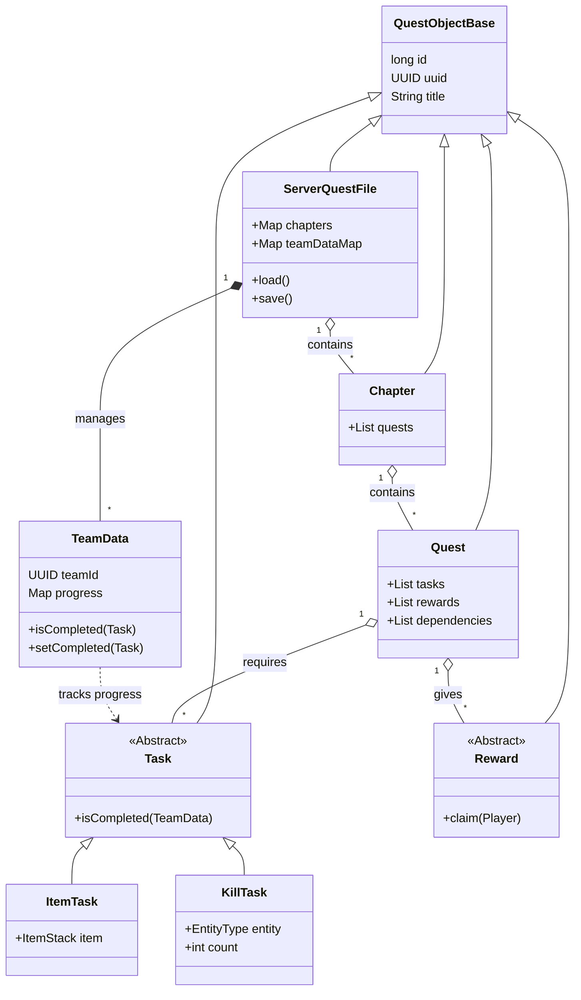
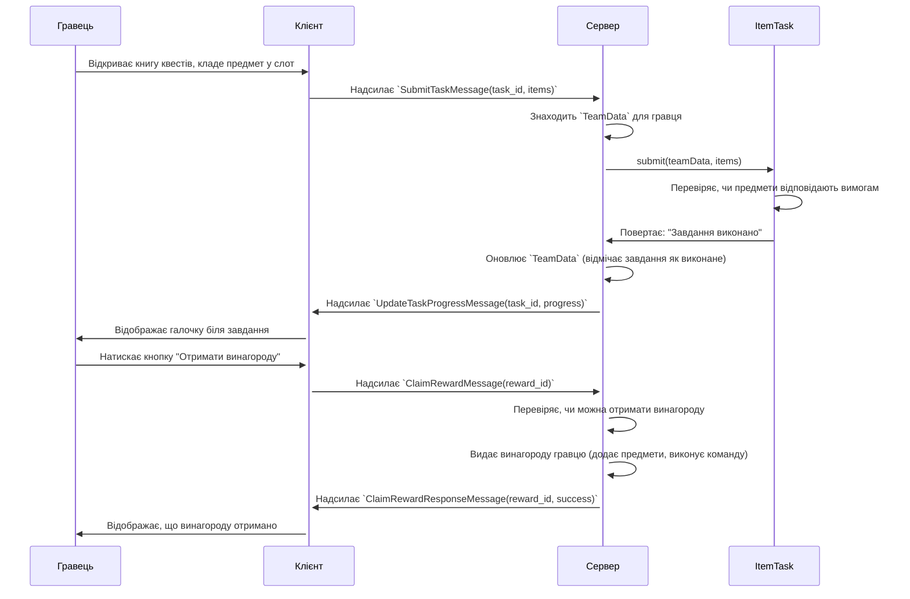

# Глибокий аналіз архітектури FTB Quests

Цей документ містить детальний аналіз архітектури, логіки та компонентів моду FTB Quests (версія 1.20.1-main) та його інтеграції з проєктом Dynamic SkyBlock Island System.

## A. Загальна архітектура
FTB Quests - це багатоплатформовий мод, розроблений з чітким розділенням ядра логіки та специфічних для платформи реалізацій.

### A.1. Структура проєкту
Проєкт розділений на три основні модулі Gradle:

*   **`common/`**: Містить переважну більшість коду (~95%). Тут реалізована вся основна логіка, що не залежить від завантажувача модів (Forge, Fabric). Це включає структуру даних квестів, логіку виконання завдань, систему винагород, мережеві пакети для синхронізації та базові обробники подій.
*   **`forge/`**: Містить мінімальну кількість коду, необхідну для інтеграції `common` логіки з Forge. В основному, це класи, що реєструють предмети, блоки, команди та обробники подій Forge, а потім передають управління до відповідних методів у `common`.
*   **`fabric/`**: Аналогічно до `forge/`, цей модуль забезпечує інтеграцію з завантажувачем модів Fabric.

Такий підхід (`architectury loom`) дозволяє розробникам підтримувати одну кодову базу для кількох платформ, що значно спрощує розробку та виправлення помилок.

### A.2. Ключові класи та їхня роль
Архітектура моду обертається навколо кількох ключових класів, які представляють структуру та стан квестів.

*   **`FTBQuests.java`**: Головний клас-ініціалізатор моду. Відповідає за реєстрацію базових компонентів та запуск процесу завантаження квестів.
*   **`QuestObjectBase.java`**: Абстрактний базовий клас для майже всіх сутностей у моді (розділи, квести, завдання, винагороди). Він надає спільні властивості, такі як унікальний ID (числовий), UUID, заголовок, іконку та теги.
*   **`ServerQuestFile.java`**: Центральний клас на стороні сервера. Це "мозок" моду. Він є єдиним об'єктом, що завантажується зі структури файлів квестів і містить у собі **все**: всі розділи, всі квести, всі завдання, а також управляє даними прогресу всіх гравців/команд (`TeamData`). Коли в коді йдеться про "файл квестів", мається на увазі екземпляр цього класу.
*   **`Chapter.java`**: Представляє розділ або вкладку у книзі квестів. Є контейнером для квестів.
*   **`Quest.java`**: Представляє один квест. Містить у собі список завдань (`Task`), які потрібно виконати, та список винагород (`Reward`), які можна отримати. Також визначає залежності від інших квестів.
*   **`Task.java`**: Абстрактний клас для завдання. Має безліч реалізацій (`ItemTask`, `KillTask`, `LocationTask` і т.д.), кожна з яких відповідає за свою логіку перевірки виконання.
*   **`Reward.java`**: Абстрактний клас для винагороди. Також має різні реалізації (`ItemReward`, `CommandReward`, `XpReward`).
*   **`TeamData`**: Критично важливий клас, що зберігає **прогрес** для однієї команди (або гравця-одинака). Кожен екземпляр `TeamData` містить інформацію про те, які завдання виконані, які винагороди отримані, коли були завершені квести тощо. `ServerQuestFile` управляє мапою цих об'єктів.

### A.3. Діаграма класів
Ця діаграма спрощено показує ієрархію та взаємозв'язки між ключовими класами.

## B. Життєвий цикл даних
Мод ретельно розділяє структуру квестів (яка є однаковою для всіх) та прогрес гравців (який є унікальним для кожної команди).

### B.1. Зберігання даних
Всі дані зберігаються у світі гри, зазвичай у директорії `saves/<world_name>/ftbquests/`.

*   **Структура квестів (`chapters/`, `quests/`, `rewards/`)**:
    *   Сам "файл квестів" (`ServerQuestFile`) розбитий на окремі файли у форматі `NBT` (Named Binary Tag), який є стандартним для Minecraft.
    *   Кожен розділ, квест, завдання і винагорода зберігаються в окремому файлі. Наприклад, файл `saves/<world_name>/ftbquests/quests/01234567.nbt` містить дані одного квесту.
    *   Цей підхід дозволяє редагувати квести "на льоту" без необхідності перезавантажувати весь файл.
    *   Ці дані завантажуються на сервері при старті світу і є об'єктом `ServerQuestFile`.

*   **Прогрес гравців (`data.snbt`)**:
    *   Прогрес *всіх* команд зберігається в одному файлі `data.snbt` (`String-based NBT`).
    *   Кожна команда має свій запис у цьому файлі, ідентифікований за її унікальним UUID.
    *   У цьому записі зберігається інформація про виконані завдання, отримані винагороди та таймери.
    *   Ці дані завантажуються в `ServerQuestFile` і зберігаються в `teamDataMap`. Збереження відбувається періодично та при зупинці сервера.

### B.2. Синхронізація даних (Сервер-Клієнт)
Оскільки вся логіка виконується на сервері, клієнт повинен отримувати актуальну інформацію для відображення GUI (книги квестів).

1.  **Початкова синхронізація**: Коли гравець заходить на сервер, сервер надсилає йому один великий пакет (`SyncQuestFileMessage`), який містить **всю структуру квестів**. Клієнт створює свій власний екземпляр `ClientQuestFile` з цими даними.
2.  **Синхронізація прогресу**: Одразу після цього, сервер надсилає інший пакет (`SyncTeamDataMessage`), який містить об'єкт `TeamData` *тільки для команди цього гравця*.
3.  **Оновлення в реальному часі**: Коли на сервері відбувається зміна, що стосується гравця (наприклад, виконалося завдання, квест став доступним), сервер надсилає невеликі, цільові пакети для оновлення. Наприклад:
    *   `UpdateTaskProgressMessage`: Оновлює прогрес конкретного завдання.
    *   `ClaimRewardResponseMessage`: Повідомляє клієнту, що винагороду успішно отримано.
4.  **Взаємодія з клієнта**: Коли гравець виконує дію в GUI (наприклад, натискає кнопку "Отримати винагороду"), клієнт надсилає запит на сервер (наприклад, `ClaimRewardMessage`), сервер обробляє його і надсилає відповідь. Клієнт **ніколи не змінює свій стан напряму**.

Цей механізм гарантує, що сервер є єдиним джерелом правди, а клієнт лише відображає отримані дані.

### B.3. Діаграма: Виконання завдання
Ця діаграма показує, що відбувається, коли гравець виконує завдання типу "покласти предмет у слот".

## C. Система подій та завдань
Більшість завдань у FTB Quests виконуються автоматично, реагуючи на дії гравця у світі. Це досягається за допомогою системи обробки ігрових подій.

### C.1. Обробка ігрових подій
*   **Клас `FTBQuestsEventHandler.java`**: Це центральний хаб для перехоплення подій. Він підписується на різноманітні події, що надаються Forge API, такі як:
    *   `EntityDeathEvent`: Для завдань на вбивство мобів (`KillTask`).
    *   `PlayerInteractEvent`: Для взаємодії з блоками.
    *   `TickEvent.PlayerTickEvent`: Для завдань, що вимагають постійної перевірки, наприклад, знаходження в певній локації (`LocationTask`).
    *   `PlayerContainerEvent.Open`: Для взаємодії з інвентарями.

*   **Делегування до завдань**: Коли `FTBQuestsEventHandler` отримує подію, він не обробляє її сам. Замість цього, він ітерує по списку всіх активних завдань (`ServerQuestFile.getLivingPlayerTasks()`) і передає подію кожному з них.
*   **Приклад**: Коли гравець вбиває зомбі, `FTBQuestsEventHandler` отримує `EntityDeathEvent`. Він знаходить `TeamData` гравця і викликає метод `onEntityDeath(event)` для кожного екземпляру `KillTask`, який ще не виконаний цією командою. `KillTask`, у свою чергу, перевіряє, чи відповідає вбитий моб його вимогам, і якщо так, збільшує внутрішній лічильник прогресу для цієї команди.

*   **Оптимізація**: Мод намагається оптимізувати цей процес, кешуючи списки активних завдань за їхнім типом, щоб не перебирати всі існуючі завдання при кожній події.

### C.2. Механізм виконання завдань
Існує два основних способи виконання завдань:

1.  **Пасивне/Автоматичне виконання (через події)**:
    *   Це стосується більшості завдань: вбивство мобів, знаходження в зоні, отримання досягнення.
    *   **Процес**:
        1.  Гравець виконує дію в грі.
        2.  `FTBQuestsEventHandler` перехоплює подію.
        3.  Подія делегується до відповідного типу `Task`.
        4.  `Task` оновлює прогрес у `TeamData`.
        5.  `TeamData` перевіряє, чи досягнуто 100% прогресу.
        6.  Якщо так, `TeamData.setCompleted()` викликає `Task.onCompleted()`, що, в свою чергу, перевіряє, чи всі інші завдання в квесті виконані.
        7.  Якщо весь квест виконаний, `Quest.onCompleted()` автоматично видає "невидимі" винагороди і робить видимі винагороди доступними для отримання.
        8.  Сервер надсилає клієнту `UpdateTaskProgressMessage`, і гравець бачить оновлення в GUI.

2.  **Активне виконання (через GUI)**:
    *   Це стосується завдань, що вимагають від гравця свідомої дії, найчастіше - `ItemTask`.
    *   **Процес**:
        1.  Гравець відкриває книгу квестів і перетягує предмети у слот завдання.
        2.  Клієнт надсилає на сервер пакет `SubmitTaskMessage` з ID завдання та списком предметів.
        3.  Сервер знаходить відповідний `ItemTask` і викликає його метод `submit()`.
        4.  Метод `submit()` перевіряє, чи предмети відповідають вимогам, і забирає їх з інвентаря гравця.
        5.  Якщо все вірно, він так само оновлює прогрес у `TeamData`, і подальший процес відбувається як у пасивному сценарії.

## D. Інтеграція з `mods-server`
Стандартний FTB Quests працює з власною системою команд. Для вашого проєкту була проведена кастомізація, щоб інтегрувати його з централізованою системою команд, яка керується через `api` та `mods-server`. Ця інтеграція є "жорсткою" (hard dependency), оскільки код FTB Quests напряму імпортує та викликає класи з `mods-server`.

### D.1. Точки інтеграції
Аналіз коду показує три основні точки, де FTB Quests залежить від `mods-server`:

1.  **`dev.ftb.mods.ftbquests.quest.BaseQuestFile`**:
    *   **Код**: `UUID islandId = com.skyblock.dynamic.nestworld.mods.NestworldModsServer.ISLAND_PROVIDER.getCachedTeamId(player.getUUID());`
    *   **Призначення**: Це найважливіша точка інтеграції. Коли FTB Quests потрібно визначити, до якої команди належить гравець, він не використовує свою внутрішню логіку, а напряму викликає метод `getCachedTeamId()` з вашого `IslandProvider`. Це гарантує, що дані про команди є єдиними та синхронізованими з вашою системою.

2.  **`dev.ftb.mods.ftbquests.net.SubmitTaskMessage`**:
    *   **Код**: Перевірки `isMember` та `isCorrectIsland`, які використовують `QuestTeamBridge` та `SkyBlockMod` з `mods-server`.
    *   **Призначення**: Коли гравець намагається здати завдання (наприклад, покласти предмети в слот), на сервері відбувається додаткова перевірка. Стандартна логіка FTB Quests просто перевіряє, чи може команда здати завдання. Ваша кастомізація додає два рівні захисту:
        1.  `isMember`: Перевіряє, чи гравець, що надіслав пакет, дійсно є членом команди, для якої він намагається здати квест.
        2.  `isCorrectIsland`: Перевіряє, чи гравець знаходиться на правильному острові (тобто UUID власника острова збігається з ID команди). Це запобігає можливим атакам, коли гравець з одного острова намагається вплинути на квести іншого.

3.  **`dev.ftb.mods.ftbquests.net.ClaimRewardMessage`**:
    *   **Код**: Аналогічні перевірки `isMember` та `isCorrectIsland`.
    *   **Призначення**: Так само, як і з завданнями, при спробі отримати винагороду виконуються ті ж самі перевірки, щоб переконатися, що гравець має на це право і знаходиться на своєму острові.

### D.2. Використання даних про команди та острови
Інтеграція повністю змінює спосіб, у який FTB Quests працює з командами:

*   **Єдине джерело правди**: `mods-server` (який, у свою чергу, отримує дані від `api`) стає єдиним джерелом інформації про склад команд. FTB Quests лише "читає" ці дані.
*   **Прив'язка прогресу до острова**: Прогрес квестів (`TeamData`) тепер жорстко прив'язаний не просто до команди, а до конкретного острова, оскільки ID команди = UUID власника острова.
*   **Безпека**: Додаткові перевірки в мережевих пакетах значно підвищують безпеку, унеможливлюючи здачу квестів або отримання винагород від імені іншої команди.

## E. Висновки та рекомендації

*   **Архітектура FTB Quests**: Мод має добре продуману, модульну архітектуру. Розділення на `common` та `forge`/`fabric` є сучасною практикою. Централізація стану в `ServerQuestFile` та `TeamData` робить логіку передбачуваною. Система подій та мережева синхронізація є надійними.

*   **Інтеграція з `mods-server`**:
    *   **Сильні сторони**: Інтеграція досягає своєї мети — вона успішно змушує FTB Quests працювати з вашою зовнішньою системою команд. Перевірки безпеки в мережевих пакетах є критично важливими та реалізовані правильно.
    *   **Слабкі сторони / Ризики**: "Жорстка" залежність означає, що ви не можете оновити FTB Quests до нової версії, просто замінивши `.jar` файл. Будь-яке оновлення потребуватиме повторного внесення ваших кастомних змін у вихідний код моду та його перекомпіляції. Це значно ускладнює підтримку проєкту в довгостроковій перспективі.

*   **Рекомендації**:
    1.  **Створити API/SPI в `mods-server`**: Замість того, щоб FTB Quests напряму викликав класи з `mods-server`, розгляньте можливість створення в `mods-server` спеціального API (Application Programming Interface) або SPI (Service Provider Interface). `mods-server` міг би надавати сервіс `TeamProvider`, а FTB Quests - використовувати його. Це дозволило б слабше зв'язати модулі. Однак, це все одно потребуватиме кастомізації FTB Quests.
    2.  **Використовувати події**: Більш гнучкий підхід - це використання системи подій. `mods-server` міг би слухати події від FTB Quests (якщо такі є, або додати їх) і втручатися в їхню логіку, або навпаки.
    3.  **Документування змін**: Оскільки підтримка форку є складною, **критично важливо** детально задокументувати всі внесені зміни. Створіть у вашому репозиторії документ, який би перелічував всі файли, що були змінені, та описував суть кожної зміни. Це значно спростить процес оновлення моду в майбутньому.
