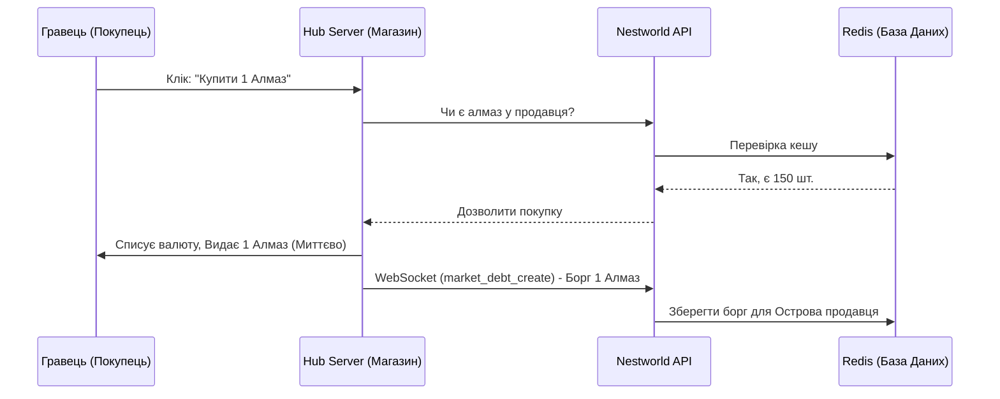
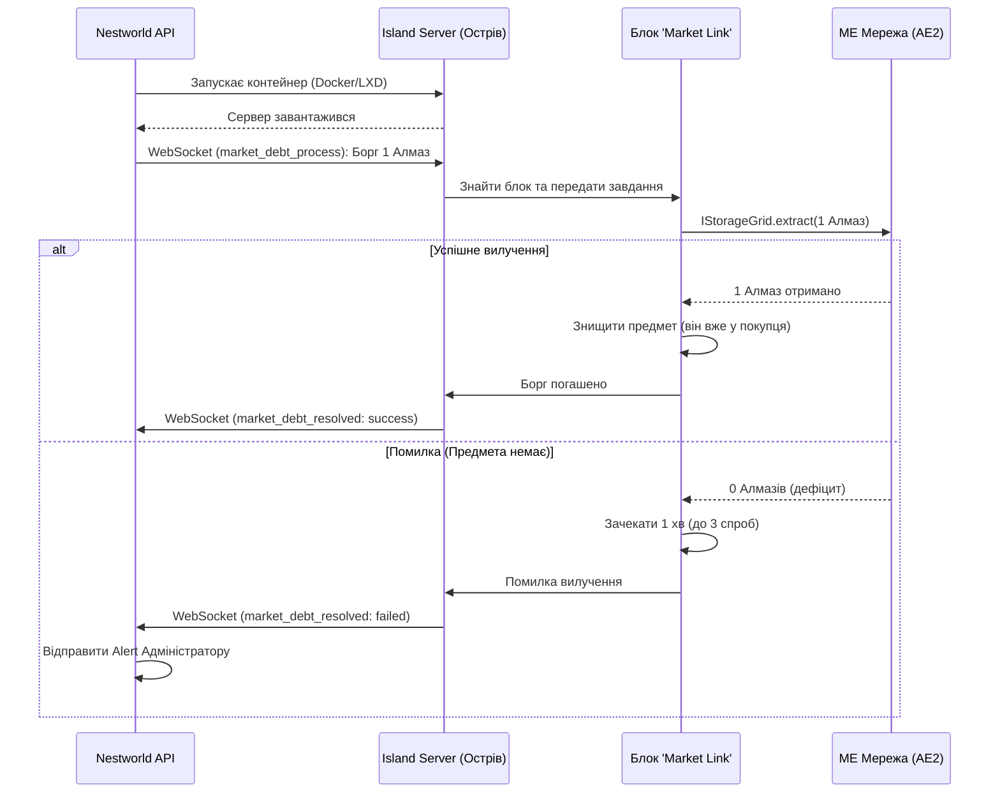

# Детальна технічна інструкція з інтеграції мода RealMarket для системи Nestworld

Цей документ є максимально детальним технічним завданням (ТЗ) для розробника мода `RealMarket`. Він описує архітектуру, конкретні API (AE2, WebSocket), структуру даних та послідовність дій для реалізації крос-серверної торгівлі в екосистемі Nestworld.

---

## 1. Архітектура системи та ролі серверів

Екосистема складається з трьох вузлів:
1. **Hub Server (Спавн):** Працює в режимі `HUB SERVER`. Тут гравці купують предмети. Тут знаходяться фізичні магазини (Плоти).
2. **Island Servers (Острови):** Працюють у режимі `ISLAND SERVER`. Тут стоїть МЕ Мережа (AE2) гравця-продавця з товаром. Острів може бути **офлайн** (контейнер зупинений).
3. **API (FastAPI + Redis):** Центральний маршрутизатор. Зберігає кеш товарів, чергу боргів та пересилає WebSocket пакети між Hub та Island.

---

## 2. Блок "Market Link" на сервері Острова

Цей блок є мостом між МЕ Мережею (AE2) продавця та нашим API.

### 2.1. Реєстрація та прив'язка
- Блок повинен бути звичайним `BlockEntity` (TileEntity).
- При встановленні блоку (`onBlockPlacedBy` / `setPlacedBy`), необхідно **жорстко прив'язати** його до поточного острова.
- **Отримання ID острова:** Використовуйте існуючий клас з `mods-server`:
  ```java
  // Отримання UUID власника острова (або Team ID), де зараз знаходиться гравець
  UUID islandId = NestworldModsServer.ISLAND_PROVIDER.getIslandId();
  ```
- Якщо гравець намагається поставити блок не на своєму острові — скасувати подію (`Event.setCanceled(true)`).

### 2.2. Інтеграція з Applied Energistics 2 (AE2)
Блок `Market Link` повинен підключатися до кабелів AE2.
- Блок має імплементувати `appeng.api.networking.IGridNodeProvider` (або `IInWorldGridNodeHost` для сучасних версій AE2).
- Для доступу до інвентарю мережі потрібно отримати `appeng.api.storage.MEStorage` (або `IStorageGrid`):
  ```java
  IGridNode node = this.getGridNode();
  if (node != null) {
      IGrid grid = node.getGrid();
      IStorageGrid storageGrid = grid.getCache(IStorageGrid.class);
      MEStorage inventory = storageGrid.getInventory();
  }
  ```

---

## 3. Синхронізація товарів (Inventory Sync)

Оскільки острів вимикається, API повинно знати точну кількість предметів у МЕ Мережі на момент вимкнення.

### 3.1. Тригери синхронізації
Мод повинен відправляти WebSocket повідомлення з масивом доступних товарів:
1. **Кожні 2-3 хвилини:** Використовуйте `TickEvent.ServerTickEvent` (рахуйте тіки, наприклад `ticks % 3600 == 0`). Сканування МЕ мережі (`inventory.getAvailableStacks()`) має відбуватися асинхронно, щоб не зупиняти Server Thread (Main Thread).
2. **При запуску сервера:** Підпишіться на подію `ServerStartedEvent`.
3. **При зупинці сервера:** Підпишіться на подію `ServerStoppingEvent` (це критично важливо, щоб зафіксувати остаточний стан перед офлайном).

### 3.2. Формат WebSocket пакета (Sync)
Відправляти через існуюче WebSocket з'єднання (або створити власне до нашого API):
```json
{
  "action": "market_sync",
  "island_id": "uuid-острова",
  "items": [
    {
      "item_id": "minecraft:diamond",
      "nbt": "{...}", // якщо є специфічні NBT (енчанти тощо)
      "amount": 150,
      "price": 10.50 // ціна у валюті сайту (береться з налаштувань Market Link блоку)
    },
    {
      "item_id": "appliedenergistics2:logic_processor",
      "amount": 42,
      "price": 5.00
    }
  ]
}
```
*API збереже цей стан у Redis. Коли Hub сервер запитає "Скільки алмазів у гравця X?", API миттєво відповість з Redis.*

---

## 4. Процес покупки (на Hub) та система "Боргу" (Debt)

Це найскладніший і найважливіший етап, що дозволяє купувати речі, коли продавець офлайн.

### 4.1. Дія на Hub Сервері (Покупка)
1. Гравець клікає на предмет у магазині на спавні.
2. `RealMarket` на Hub-сервері робить запит до API: "Чи є товар?". API перевіряє кеш Redis.
3. Якщо товар є:
   - Hub списує валюту з балансу покупця.
   - Hub **миттєво** видає (спавнить/додає в інвентар) предмет покупцю.
   - Hub відправляє в API повідомлення про успішну транзакцію (створення боргу).

### 4.2. Формат пакета створення боргу (Hub -> API)
```json
{
  "action": "market_debt_create",
  "seller_island_id": "uuid-острова-продавця",
  "item_id": "minecraft:diamond",
  "nbt": "{...}",
  "amount": 5
}
```

### 4.3. Вилучення товару на Island Сервері (Погашення боргу)
Коли сервер острова запускається (API запустить його автоматично через наявність боргу), він отримує від API список боргів через WebSocket:

```json
{
  "action": "market_debt_process",
  "debts": [
    {
      "debt_id": "унікальний-id-боргу",
      "item_id": "minecraft:diamond",
      "amount": 5
    }
  ]
}
```

**Алгоритм обробки модом на Острові:**
1. Знайти активний блок `Market Link`.
2. Звернутися до МЕ Мережі (`MEStorage.extract(...)`).
3. **Успіх:** Якщо `5` алмазів вилучено, знищити їх (вони вже видані покупцю на Hub). Відправити в API підтвердження:
   ```json
   { "action": "market_debt_resolved", "debt_id": "унікальний-id-боргу", "status": "success" }
   ```
4. **Помилка (Дефіцит):** Якщо в МЕ Мережі виявилось лише `2` алмази (розсинхрон, продавець забрав їх руками).
   - Мод робить ще `3` спроби з інтервалом в 1 хвилину (можливо, автокрафт доробляє алмази).
   - Якщо після `3` спроб предметів немає, відправити Alert:
   ```json
   { "action": "market_debt_resolved", "debt_id": "унікальний-id-боргу", "status": "failed_insufficient_items", "extracted_amount": 2 }
   ```
   *Далі API відправить повідомлення адміністрації в Discord/Логи для ручного розбору. Гравцям нічого не скасовується.*

---

## 5. Система Плотів (Територій) на Hub-сервері

Щоб магазини фізично існували на спавні, потрібно реалізувати систему плотів.

### 5.1. Розмітка та генерація
- Координати плотів мають бути строго визначені (наприклад, по сітці з відступом).
- Коли гравець купує/орендує плот, мод повинен створити "Приват" (захищену зону).
- Можна використовувати власну логіку підписки на події `BlockBreakEvent`, `BlockPlaceEvent`, `PlayerInteractEvent` для скасування взаємодії, якщо гравець не є власником (`UUID` команди) цього плоту.

### 5.2. Телепортація
- Мод повинен надати команду (наприклад, `/market visit <назва_острова>`).
- При виконанні, гравця телепортує на координати `(X, Y, Z)` відповідного плоту.

### 5.3. Підписка (Оренда)
Оренда плоту коштує реальні гроші (або сайт-валюту) щомісяця.
- Мод не повинен самостійно рахувати дні.
- Мод повинен мати RCON або консольну команду, яку буде викликати наш білінг-сервер раз на місяць:
  ```bash
  /realmarket plot renew <island_uuid> <місяці>
  ```
- Якщо підписка закінчилась (мод перевіряє внутрішній таймер, який додається командою вище):
  - Плот "заморожується": інші гравці не можуть нічого купити в цьому фізичному магазині.
  - Власник плоту втрачає права на будівництво/руйнування до моменту оплати, але його блоки не видаляються.

## 6. Важливі вимоги безпеки та продуктивності
1. **Ніяких Main Thread HTTP/WebSocket викликів.** Всі мережеві запити (`market_sync`, `market_debt_resolved`) повинні виконуватися в `CompletableFuture.runAsync()`, щоб сервер не лагав ("Server hung" watchdog).
2. Оскільки модифікація інвентарю AE2 (`extract`) має виконуватись у головному потоці (Server Thread), робіть вилучення під час `ServerTickEvent`, а мережеву відправку результату перекидайте в асинхронний потік.

---

## 7. Візуалізація взаємодії (Блок-схеми)

Для кращого розуміння процесу, нижче наведені схеми взаємодії між компонентами системи. Ці схеми можна переглянути за допомогою інструментів візуалізації Markdown (наприклад, плагінів Mermaid для VS Code або GitHub).

### 7.1. Загальна архітектура та синхронізація залишків

Ця схема показує, як блок `Market Link` (на сервері Острова) зчитує дані з МЕ Мережі та відправляє їх до нашого API для збереження в Redis.

```mermaid
graph TD
    subgraph "Island Server (Острів Продавця)"
        ME[МЕ Мережа (AE2)] -- Кабель --> ML[Блок 'Market Link']
        ML -- Сканує інвентар кожні 3 хв --> ML
    end

    ML -- WebSocket (market_sync) --> API[Nestworld API]
    API -- Зберігає кількість товарів --> DB[(Redis Cache)]

    subgraph "Hub Server (Спавн)"
        Shop[Магазин (Плот)] -. Запитує наявність .-> API
    end
```

### 7.2. Процес покупки (Гравець купує на Hub)

Схема відображає моментальну видачу предмета покупцю на Hub-сервері та фіксацію "боргу" в системі.



### 7.3. Погашення боргу (Острів продавця запускається)

Схема показує, як сервер острова отримує інформацію про борг і вилучає проданий предмет з МЕ Мережі.


